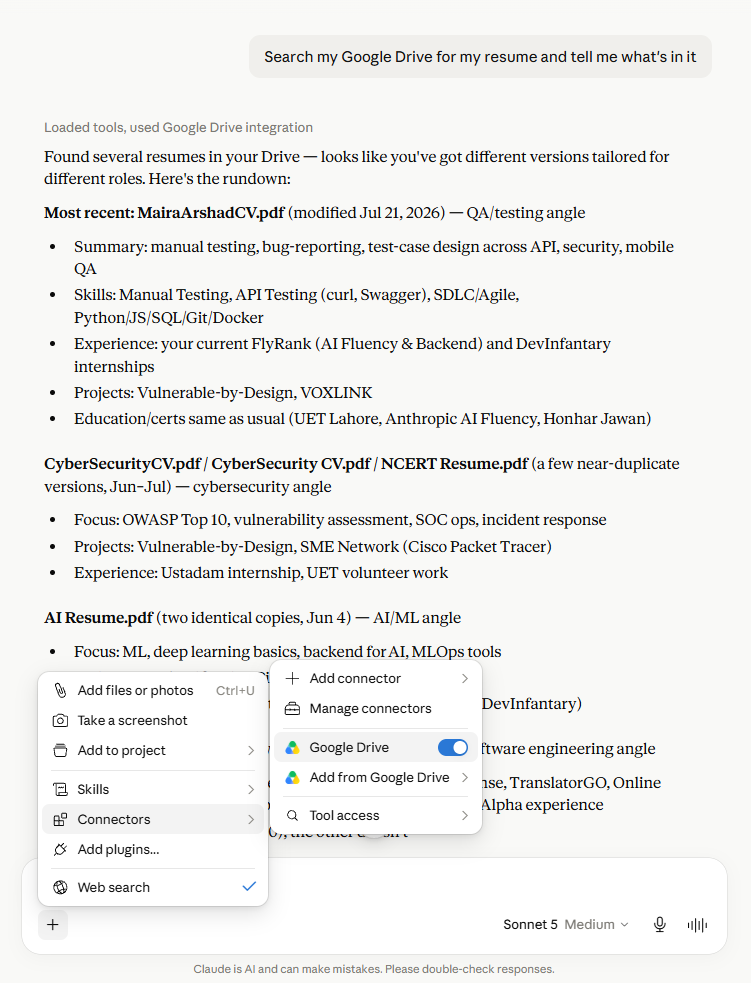
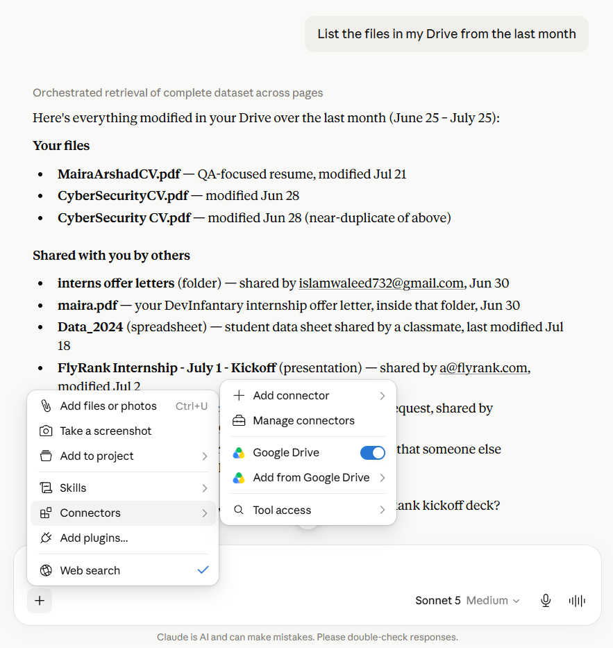
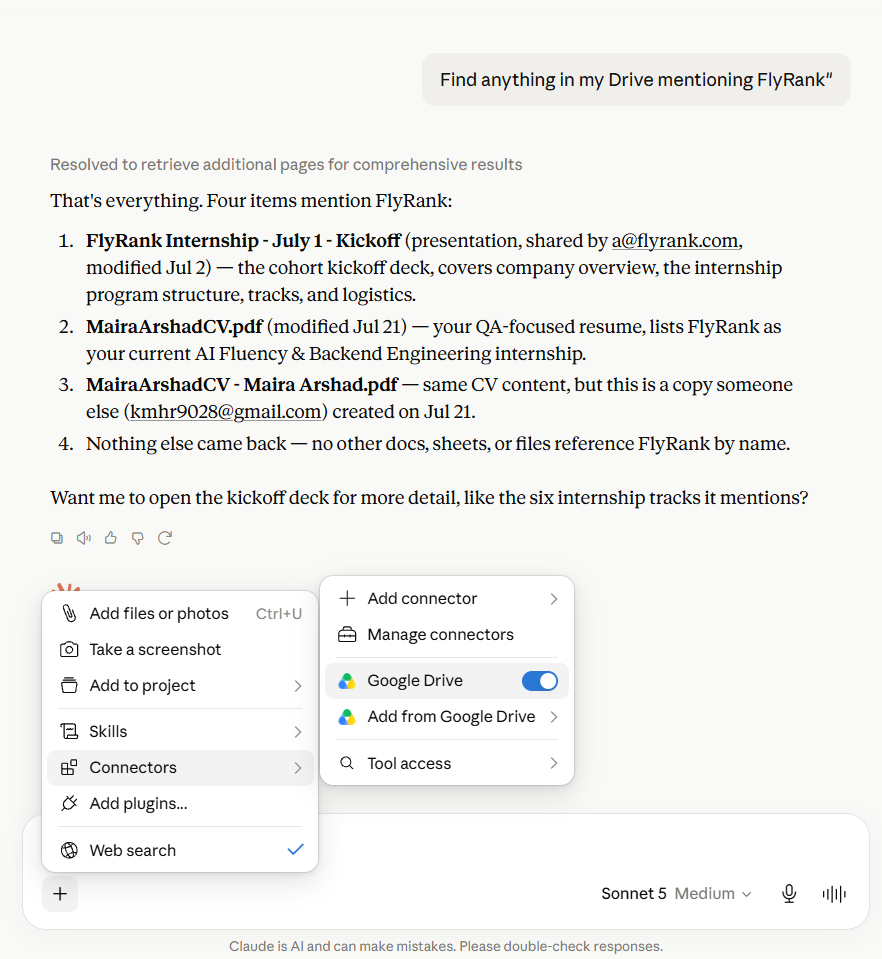

# Agent Concepts and MCP Basics
**Track:** General AI Fluency, FlyRank Internship, Build Phase

---

## Workflow vs Agent

A workflow is when the code decides what happens next. I write the steps in a fixed order ahead of time, gather, then draft, then critique, then revise, and each step's output feeds into the next one exactly the way I designed it. The model does real thinking inside each step, but it never gets to decide what step comes after the one it's on, that decision is already made by me before the run even starts.

An agent is different. Instead of following a path I wrote in advance, the model decides its own next move based on what it sees happening around it, a tool result, a file it just read, an error it just hit, and it keeps deciding, step by step, until it thinks the task is actually done.

My FL-04 pipeline, draft, critique, revise, is a workflow, not an agent. Specifically it's what Anthropic calls prompt chaining, one fixed sequence, each step handing its output to the next. At no point does the model choose to skip a step, repeat one, or go do something I didn't tell it to do. That's not a weakness, it's actually the right choice for this task, since outreach messages don't need open ended exploration, they need a predictable, repeatable process.

---

## What MCP Is

MCP stands for Model Context Protocol. It's a standard way for an AI model to connect to things outside the chat window, your files, a live database, a calendar, without every developer having to build a custom integration from scratch every time. Anthropic describes it as a USB-C port for AI, one standard connector instead of a different cable for every device.

MCP has three building blocks:

Tools are actions the model can actually do, search a file, send a message, run a query. This is the part most people mean when they say agent, even though tools alone don't make something an agent.

Resources are data the model can read, a file's contents, a record in a database, without necessarily acting on it.

Prompts are reusable templates a server can hand to the model, so common tasks don't need to be explained from scratch every single time.

---

## Connecting a Real MCP Server

I connected the Google Drive connector to Claude and ran three tasks that plain chat could never answer, since none of this information exists inside a model's training, it only exists inside my actual account.

**Task 1:** Asked it to search my Drive for my resume and tell me what's in it. It found four different resume versions I'd forgotten I had, a QA focused one, a cybersecurity one, an AI/ML one, and an older general software engineering one, and summarized what each one emphasized. Plain chat has no access to my Drive at all, it would have had to guess or ask me to paste the content in manually.

**Task 2:** Asked it to list everything modified in my Drive in the last month. It returned real files with real modification dates, including an internship offer letter someone shared with me and a FlyRank kickoff deck, information that only exists in my actual Drive, not anywhere a model could know on its own.

**Task 3:** Asked it to find anything mentioning FlyRank across my Drive. It searched and returned four specific matching files by name, with the reasoning visible, "resolved to retrieve additional pages for comprehensive results," meaning it was actually paging through real search results, not producing a guess.

All three responses showed visible tool use, phrases like "loaded tools, used Google Drive integration," not just a normal chat answer. That's the actual proof this wasn't chat pretending to know something, it was really reaching into an external system.

---

## What My FL-04 Workflow Would Need to Become an Agent

Right now my draft, critique, revise pipeline is a fixed sequence I control. To actually become an agent, it would need to stop following my fixed order and start deciding its own next step based on what it finds.

The clearest upgrade: instead of me manually telling it who to write to and pasting in context every time, an agent version could use an MCP connection to my own Google Drive or Gmail to look up a company's real name, contact, and job requirements itself, decide whether the eligibility actually matches (like the fresh graduate problem from Run 5), and only then choose whether to draft a message at all, loop back for more research if something's missing, or flag it to me if it can't verify something. That's the real difference, right now the pipeline runs to the end no matter what it finds, an agent version would be able to stop, go check something, and change its own next move based on what it actually sees.

I wouldn't want this fully autonomous though, sending outreach messages is exactly the kind of task where a wrong or overconfident move has real consequences, so any agent version of this should still pause and ask me before actually sending anything, not just before drafting it.