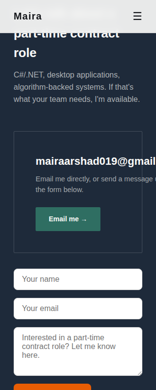
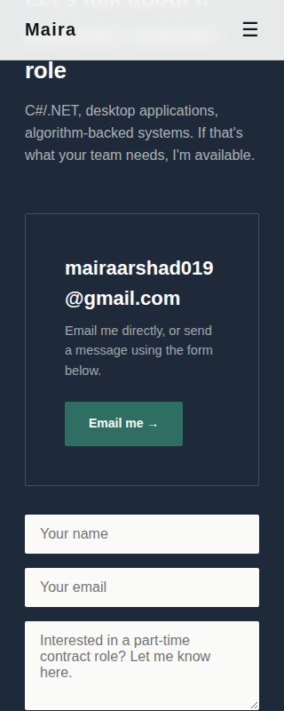

# Fix Log — Open It on Your Phone (Week 7)

How this was tested: rendered the live HTML in a headless browser at real phone widths (320, 360, 375, 390, 414, 430px), tablet (768px), and desktop (1440px), measured actual tap-target sizes and scroll widths, and checked computed WCAG contrast ratios. Screenshots before/after for each fix are below.

## 1. Horizontal scroll on common phone widths (MUST FIX — found and fixed)

**What was broken:** The email address in the Contact section (`mairaarshad019@gmail.com`) is one unbroken string with no spaces. At 320px and 360px viewport widths — a large share of Android phones — the layout wouldn't let that text wrap, so it pushed the page wider than the screen. Result: the whole site had a horizontal scrollbar and the email ran off the edge, unreadable.

**What I changed:** Added `overflow-wrap: anywhere` to the email heading and `min-width: 0` to its flex container, so the browser can break the string and the flex item can actually shrink.

**Verified:** Measured `scrollWidth` vs viewport width at 320/360/375/390/414/430/768/1024/1440px. All clean now (was overflowing by 51px at 320 and 360).

Before (320px, email cut off, orange button visible):

After (320px, email wraps, no overflow):

## 2. Hamburger menu tap target too small (MUST FIX — found and fixed)

**What was broken:** Measured the actual clickable area of the mobile menu button: 20×26px. The accessibility minimum is 44×44px, so this was a genuinely hard target to tap accurately on a real phone.

**What I changed:** Added padding with an offsetting negative margin so the tap target grows without shifting the visible icon position.

**Verified:** Re-measured with the browser's bounding box — now 44×50px.

## 3. Contact form didn't match the site (nice-to-have polish — found and fixed)

**What was broken:** The contact form used a different design system than the rest of the site — orange button (#E85D04), 8px rounded corners, blue focus ring — while everywhere else on the page uses teal/navy with sharp 2px corners. Looked like leftover placeholder styling, which undercuts the "trustworthy" read the assignment is going for.

**What I changed:** Restyled the form's inputs, borders, and button to use the site's actual palette and corner radius.

Before (orange button, mismatched):

After (teal button, matches site):

## Checked and already fine — no action needed

- **Color contrast:** calculated actual WCAG contrast ratios for every muted/low-opacity text color against its background. All pass AA (4.5:1+), including the smallest text (nav links, card captions, chips).
- **Responsive grid:** work cards, case study image pairs, and the About layout all correctly collapse to single-column at the 820px breakpoint. No squeezed or overlapping elements at any width tested.
- **Image weight:** largest embedded image is 82KB, nothing oversized or blurry.
- **No horizontal overflow anywhere else on the page** at any of the 9 widths tested, before or after the email fix.
- **GitHub link** (github.com/Mairaarshad19): tested directly, returns 200 OK.

## Could not verify — please check these yourself on your phone

My sandbox's network restrictions blocked me from reaching these four, so I could not confirm them programmatically (this is a limitation of my environment, not a claim that they're broken):
- LinkedIn (linkedin.com/in/mairaarshad)
- Google Drive CV link
- Google Fonts stylesheet (affects whether Space Grotesk/Inter actually load vs. falling back to system fonts)
- Formspree form endpoint (submit the form once for real to confirm it delivers)

Please tap all four on your actual phone before you submit, since the brief specifically calls for a real-device check.
